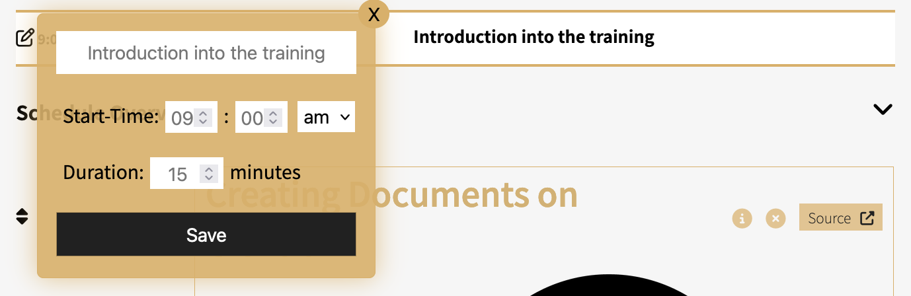
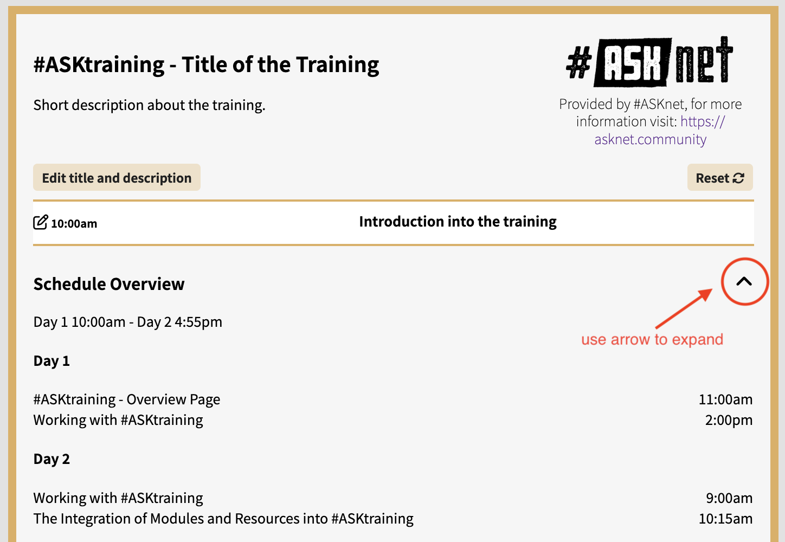
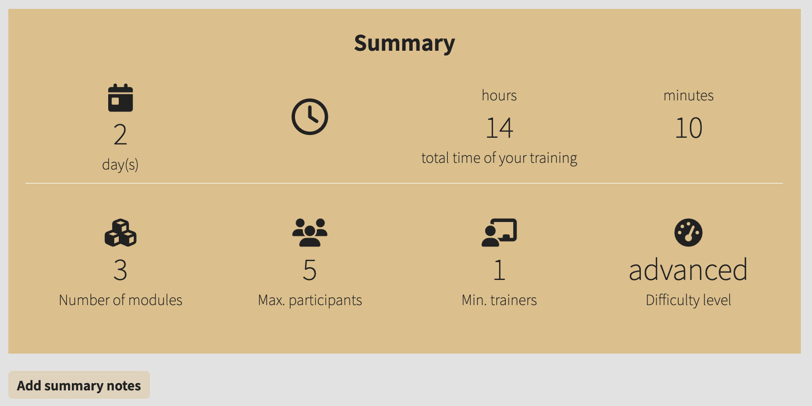
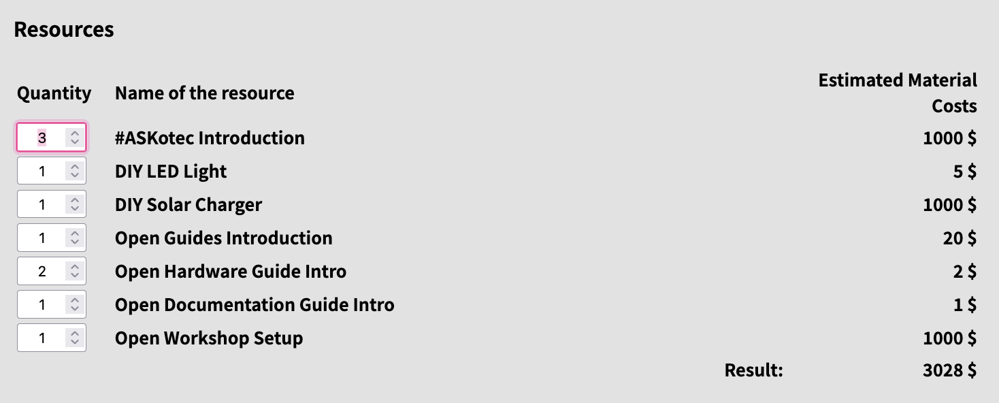

<link href='https://fonts.googleapis.com/css?family=Noto Sans' rel='stylesheet'>

# Webinar 1: #ASKtraining - What’s On? 

__Description:__
Join our webinar on #ASKtraining and unlock the full potential of this powerful online tool. Designed specifically for #ASKnet members, this session will walk you through its purpose, target groups, and core functionalities. Learn how to navigate the platform, use the filter function, and customize your training modules with ease. [You’ll also discover handy features like saving your training as a PDF and generating summaries.] By participating, you’ll have the skills to design your own training program, making your sessions more organized and impactful. Don’t miss out on this opportunity to enhance your training experience and boost your productivity!

__Table of Content:__

- [Webinar 1: #ASKtraining - What’s On?](#webinar-1-asktraining---whats-on)
  - [Module Overview Page](#module-overview-page)
    - [Understanding module boxes](#understanding-module-boxes)
    - [Tags \& Icons](#tags--icons)
    - [Module Preview](#module-preview)
    - [Filters, Tags \& Search Bar](#filters-tags--search-bar)
    - [Module Selection](#module-selection)
  - [#ASKtraining Planner](#asktraining-planner)
    - [The two main components](#the-two-main-components)
    - [Module Tags](#module-tags)
    - [Search Bar](#search-bar)
    - [Title your Training](#title-your-training)
    - [Personalise Modules](#personalise-modules)
    - [Plan it your way!](#plan-it-your-way)
    - [Module Time Slots](#module-time-slots)
    - [Day Break](#day-break)
    - [Introduction and Duration](#introduction-and-duration)
    - [Introduction and Duration](#introduction-and-duration-1)
    - [Useful Features: Overview \& Summary](#useful-features-overview--summary)
    - [Useful Features: Resource Costs \& Print PDF](#useful-features-resource-costs--print-pdf)

  
<h2>#ASKtraining - Who is it for?</h2>

  

    <b>Developed to support #ASKnet members (contributors, trainers, participants)</b>
    <ul>
      <li>Open design allows for users outside #ASKnet</li>
      <li>Contributors add their skills and knowledge</li>
      <li>Trainers access a wide range of modules</li>
      <li>Participants easily find references and resources</li>
    </ul>  
  

  

      <b>Each module focuses on a specific topic with related resources</b> 
      <ul>
        <li>Design and organize trainings</li>
        <li>Co-create trainings within #ASKnet</li>
        <li>Represent collective capacities</li>
        <li>Collect Open Educational Resources</li>
        <li>Save time on research, resources, and data</li>
    </ul>
  

  

    <b>Participants use it to:</b>
    
Additional information every Module provides:
 
    <ul>
      <li>Access a collection of links to educational resources</li>
      <li>Build on their existing skills and knowledge</li>
      <li>Connect with like-minded community members</li>
      <li>Create their own training and become skilled trainers!</li>
    </ul>
  

## Module Overview Page

+ Gain a comprehensive understanding of each module and its resources.
+ Learn how to efficiently navigate through modules using filters and the search bar.
+ Explore the functionality of the training planner and how to automatically add selected modules to your training plan.

 <em>The Module Overview Page</em>

### Understanding module boxes

  

    

      <video width="350" controls>
        <source src="images/module_overview_page/module-topic_additional_info.mp4" type="video/mp4">
      </video> 
      <em>Module Box with informations</em>
    

  

  

    <b>Each module focuses on a specific topic with related resources</b>  
    
Additional information every Module provides:
 
    <ul>
      <li>Max. Participants</li>
      <li>Difficulty Level</li>
      <li>License</li>
    </ul>
  

### Tags & Icons

  

    
Modules have tags that categorize them based on their topic
Clicking a tag updates the list of modules with the same tag.

    
Modules can also be filtered by <b>Max. Participants</b> and <b>Difficulty Level</b>. Clicking the icons dynamically updates the list of modules.

  

  

    

      <video width="550" controls>
        <source src="images/module_overview_page/module-icons__tags_as_filter.mp4" type="video/mp4">
      </video>
       
      <em>Using tags and additonal information as filters</em>
    

  
  

### Module Preview

  

    

      <video width="550" controls>
        <source src="images/module_overview_page/module-module_preview_red.mp4" type="video/mp4">
      </video> 
      <em>Module preview</em>
    

  

  

    
<b>Click the module title to see:</b>
 
    <ul>
      <li>Learning objectives</li>
      <li>Introduction time</li>
      <li>Minimum required trainers</li>
      <li>Associated resources</li>
      <li>and other related information</li>
    </ul>
  

### Filters, Tags & Search Bar

  

    

      <video width="550" controls>
        <source src="images/module_overview_page/module-Filter_tags__participants.mp4" type="video/mp4">
      </video> 
      <em>Working with different filters</em>
    

  

  

    
<b>Filters: Update the list of modules dynamically using four options:</b>
 
    <ul>
      <li><b>Difficulty Level:</b> Choose from easy, medium, and advanced. Multiple selections allowed.</li>
      <li><b>Max. Participants:</b> Filter by maximum number of participants. Multiple options can be selected.</li>
      <li><b>Tags:</b> Click to filter modules by tags. Combine multiple tags. Deselect by clicking again or selecting 'All'.</li>
      <li><b>Search Bar:</b> Type to filter modules by titles and content dynamically. Clear search using the ‘Clear Search’ button.</li>
    </ul>
  

### Module Selection

  

    
<b>Selected modules are inserted into your training in the Training Planner.</b>
 
    <ul>
      <li>Click on the circle next to the title to select modules.</li>
      <li>Click on PLAN YOUR TRAINING to open the selected modules in the training planner.</li>
    </ul>
  

  

    

      <video width="550" controls>
        <source src="images/module_overview_page/module-module_selection_&_searchbar.mp4" type="video/mp4">
      </video> 
      <em>Selecting Modules to Plan your Training</em>
    

  

## #ASKtraining Planner
+ Get started with the #ASKnet Training Planner.
+ Explore the user interface and understand its functionalities.
+ Enter through the Module Overview Page with preselected modules.
+ Learn how to customize your training plan, including titles, descriptions, and schedules.

 

### The two main components 
<!-- 
 -->
  

     <em>Sidebar with modules on the left Training Planner in the center</em>
  

  <ul>
    <li>Training Planner (Central Area)</li>
    <li>Main area to plan your training</li>
    <li>List of modules to add on the left</li>
  </ul>
<!-- 
 -->

### Module Tags

  

    

      <video width="200" controls>
        <source src="images/training_planner/10_training_filter_tags.mp4" type="video/mp4"></video> 
    <em>Selecting Modules to Plan your Training</em>
    

  

  

     
    
<em>List of tags</em>
 
    <ul>
      <li>Comprehensive list of modules with filter and search options.</li>
      <li>Dynamic list: Filter modules by tags and update the list accordingly</li>
      <li>Combine multiple tags for broader search results.</li>
      <li>Drag modules from the sidebar to the training planner.</li>
      </ul>
  

### Search Bar

      <video width="700" controls>
        <source src="images/training_planner/08_training_drag__drop.mp4" type="video/mp4"></video> 
    <em>Using the Search Bar to find Modules</em>
    

 

  

    <ul>
        <li>Dynamically updates the list as you type.</li>
        <li>Filters by titles and content of modules.</li>
        <li>Use the ‘Clear Search’ button to reset.</li>
        <li>Located beneath the tags in the upper left corner.</li>
      </ul>
  

  

    

       
      <em>Search Bar</em>
    

  

### Title your Training

  

    

      <video width="550" controls>
        <source src="images/training_planner/09_training_description.mp4" type="video/mp4">
      </video> 
      <em>Editing title and description of the training</em>
    

  

  
 
    <ul>
      <li>Edit the title and description of your course</li>
      <li>Click on <b>‘Edit title and description’</b> to bring up the edit pop-up.</li>
    </ul>
  

### Personalise Modules 

  

    

      <video width="550" controls>
        <source src="images/training_planner/training-add_notes.mp4" type="video/mp4">
      </video> 
      <em>Adding personal notes to Modules and Resources</em>
    

  

  
 
    <ul>
      <li>Add personal notes to selected modules and resources</li>
      <li>Click on the <b>'Edit'</b>buttons or icons to bring up the edit pop-up.</li>
      <li>Save your changes</li>
    </ul>
  

### Plan it your way!

<b>Adjust times, modify descriptions, and specify the order of modules.</b>

  

     
    

      <em>Move modules</em>
 
    
<b>Break it up!</b> 
    Specify timing, duration, lunch and coffee breaks!

     
    

      <em>Editing the time slot</em>
 
    
<b>Adjust order of Modules</b> 
    Change the order of modules  by dragging and dropping to adjust your training schedule design

  

  

    

      <video width="450" controls>
        <source src="images/training_planner/09.1_training_order_modules_timing.mp4" type="video/mp4"></video> 
    <em>Adjust order of Modules</em>
    

  

### Module Time Slots

  

    

      <video width="550" controls>
        <source src="images/training_planner/12_training_time_slot.mp4" type="video/mp4">
      </video> 
      <em>Adding a lunch break</em>
    

  

  
 
    <b>Time Slots</b>
    <ul>
      <li>Drag and drop to insert breaks (e.g., lunch, coffee).</li>
      <li>Adjust duration and rename using the pen icon.</li>
      <li>Delet them by cliicking the 'x' on the right side</li>
    </ul>
  

### Day Break

  
 
    <b>Day Break</b>
    <ul>
      <li>Allows continuation of training on the next day.</li>
      <li>Next module starts automatically at 9:00 am.</li>
      <li>Edit duration and rename.</li>
    </ul>
  

  

    

      <video width="550" controls>
        <source src="images/training_planner/13_training_day_break.mp4" type="video/mp4">
      </video> 
      <em>Adding a Day Break</em>
    

  

### Introduction and Duration
<b>Introduction in Training Modules</b>    
<ul>
  <li>Default 15-minute introduction for each training/module.</li>
  <li>Change title, duration, and start time with the pen icon.</li>
</ul>

   
  <em>Introduction into the Training</em>

<b>Title, Duration, and Start Time</b>
<ul>
  <li>Rearrange resources within modules by dragging.</li>
  <li>Adjust resource duration using the pen icon.</li>
  <li>Dynamic updates to the start time of subsequent modules and resources</li>
</ul>

  <video width="500" controls>
    <source src="images/training_planner/14_training_order_duration_resources.mp4" type="video/mp4">
  </video> 
  <em>Adding a Day Break</em>

  

### Introduction and Duration

  
 
    <b>Introduction in Training Modules</b>
    <ul>
      <li>Default 15-minute introduction for each training/module.</li>
      <li>Change title, duration, and start time with the pen icon.</li>
    </ul>
     
    

      <em>Introduction into the Training</em>
 
    <b>Title, Duration, and Start Time</b>
    <ul>
      <li>Rearrange resources within modules by dragging.</li>
      <li>Adjust resource duration using the pen icon.</li>
      <li>Dynamic updates to the start time of subsequent modules and resources</li>
    </ul>
  

  

    

      <video width="450" controls>
        <source src="images/training_planner/14_training_order_duration_resources.mp4" type="video/mp4">
      </video> 
      <em>Adding a Day Break</em>
    

  

### Useful Features: Overview & Summary

  
 
     
    

      <em>Schedule Overview</em>
 
    <b>Schedule Overview</b>
    <ul>
      <li>Automatically generated.</li>
      <li>Lists all training modules by time and day.</li>
      <li>Access by clicking on the arrow icon.</li>
    </ul>
  

  
 
     
    

      <em>Summary</em>

     
    <b>Summary</b>
    <ul>
      <li>Provides overall duration and module count.</li>
      <li>Analyzes participant numbers and minimum requirements for resources and modules.</li>
      <li>Calculates minimum required trainers and highest difficulty level.</li>
    </ul>
  

### Useful Features: Resource Costs & Print PDF

  

    <b>List of Resources and Estimated Costs</b>
    <ul>
      <li>Summarizes all resources and their costs.</li>
      <li>Adjust quantities using the number field or arrow buttons.</li>
    </ul>
     
    

      <em>List of Resources and estimated costs</em>
 
  

  
 
    

      <video width="450" controls>
        <source src="images/training_planner/19_training_print_PDF.mp4" type="video/mp4">
      </video> 
      <em>Printing / saving training as PDF</em>
    

    <b>Print PDF</b>
    <ul>
      <li>‘Print’ button for generating a hard copy or saving as a PDF.</li>
      <li>Best results with Chromium-based browsers (e.g., Brave, Chromium)</li>
    </ul>
  

